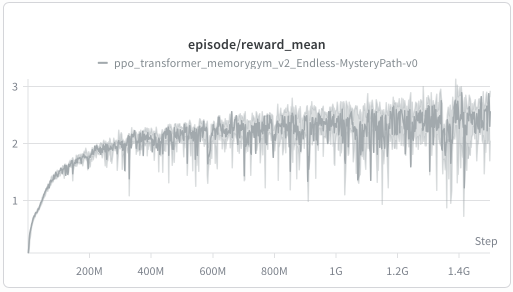
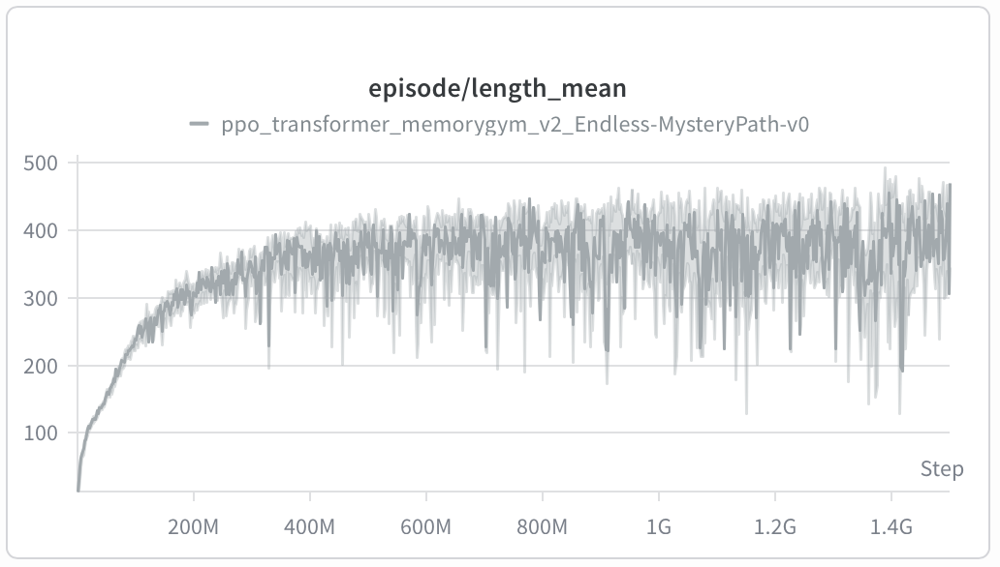
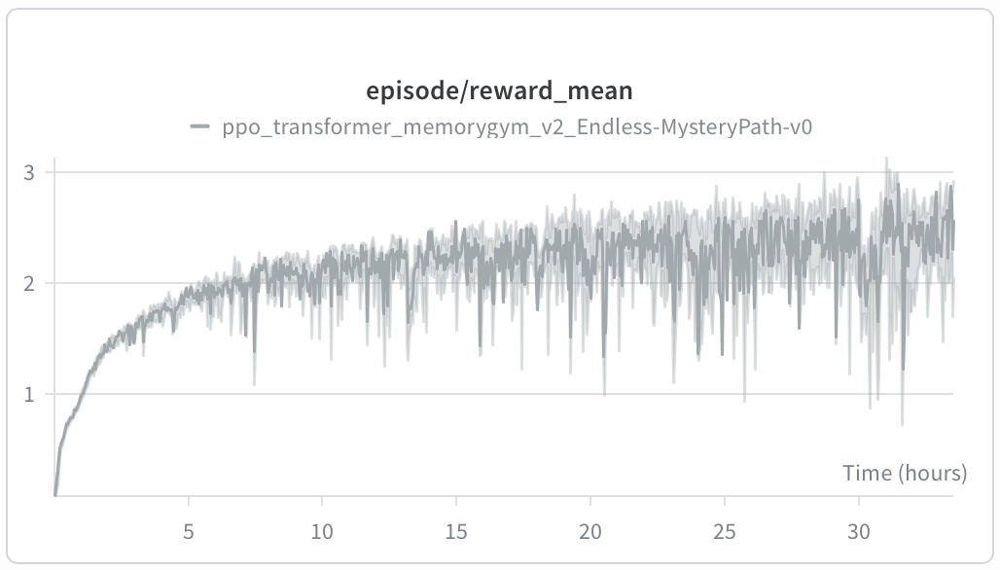
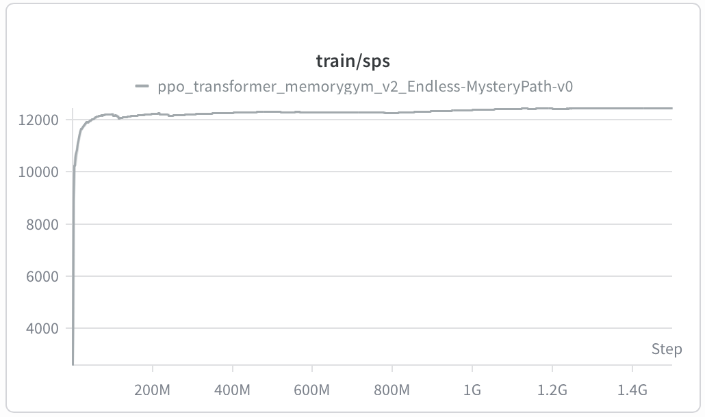
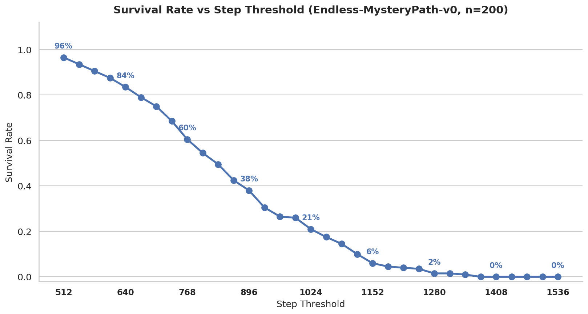

# ppo-llama-rl

PPO with LLaMA-style Transformer backbone (Flax NNX) for memory-demanding RL environments.

## Installation

```bash
pip install -r requirements.txt
wandb login
```


## Training

Trained on RTX6000 PRO + 32 CPUs. Total training time: 1 day 9 hours.

```bash
python train_memorygym.py --env-name Endless-MysteryPath-v0 --context-len 512 --save-ckpt-every 5_000_000 --learning-rate 0.0001
```

### Training Curves

<table>
  <tr>
    <td></td>
    <td></td>
  </tr>
  <tr>
    <td></td>
    <td></td>
  </tr>
</table>

## Evaluation

Two eval scripts are provided:

| Script | Purpose | Parallelism | Output |
|--------|---------|-------------|--------|
| `eval_memorygym_batch.py` | Fast stats collection | `AsyncVectorEnv` (parallel envs) | `batch_results.json` + survival rates |
| `eval_memorygym_render.py` | Video rendering | Sequential (single env) | `results.json` + mp4 videos |

### Batch evaluation (fast, no video)

```bash
python eval_memorygym_batch.py \
    --checkpoint-dir checkpoints/<run-name> \
    --env-name Endless-MysteryPath-v0 \
    --num-episodes 200 \
    --batch-size 50 \
    --max-steps 2048
```

### Render evaluation (with video)

```bash
python eval_memorygym_render.py \
    --checkpoint-dir checkpoints/<run-name> \
    --env-name Endless-MysteryPath-v0 \
    --num-episodes 20 \
    --num-videos 5 \
    --max-steps 1024
```

Results are saved to `eval_results/<run-name>/step_<step>/<env-name>/`.

### Plotting

```bash
python plot_mysterypath.py --results-path eval_results/<run-name>/step_<step>/<env-name>/batch_results.json
```

Generates a survival rate vs step threshold curve from batch eval results.


